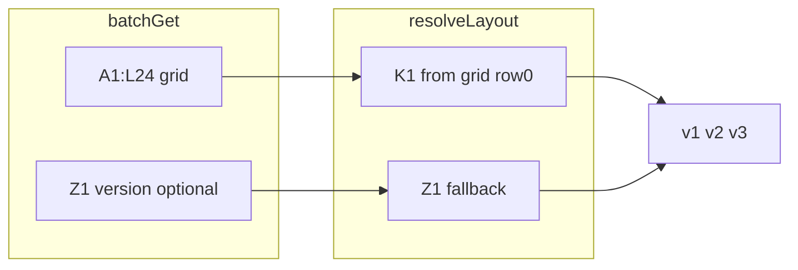

# Sheet v3 structure: JSON inference, comparison, and code impact

## How the app works today (relevant parts)

- **Fetch:** [`app.js`](app.js) uses Sheets API `values:batchGet` with two ranges: `{tab}!A1:L{DATA_END_ROW}` (`DATA_END_ROW = 18`) and `{tab}!Z1` for a semver string (e.g. `v2.0.0`).
- **Layout:** [`resolveLayout`](app.js) returns `v2` if `Z1` parses as major ≥ 2, else if row 1 column D looks like “URL”, else `v1`.
- **Parsing:** [`parseEstimateData`](app.js) assumes **row 0 is the activity header** and scans **`rows.slice(1)`**; any row with non-empty column C (`row[2]`) is an activity. For `v2`, columns D–K are URL, adult/minor/infant qty & unit prices, and excursion subtotal (same shape as your CSV activity block).
- **Passengers (summary line):** After building activities, it sets `passengers` to the **max** of `adultsQty`, `minorsQty`, and `infantsQty` across activities (lines 477–482, 509–513).
- **Issue date:** Hard-coded **`rows[4][issueCol]`** (5th row, column L for `v2`, K for `v1`) — not tied to a “Fecha preparación” label.
- **Client name:** Always **`tabName`** from the Google tab title, not a cell.
- **Per-activity lines in the UI:** Still show each activity’s own quantities (`activity.adultsQty`, etc.) in the timeline — unchanged by your requirement; only the **summary** `buildPassengerString` input changes.

[`dev/app.js`](dev/app.js) mirrors this; any implementation change should be duplicated there.

---

## Sheet footprint correction (your note)

- Do **not** assume a version string in **AA5** (or any stray cell outside the template); that was export noise.
- **v3 template effective area:** **A1:K24** (columns A–K, rows 1–24).
- **Column L:** Current **v2** logic uses **column L** for the **issue date** (`issueCol === 11`). If the API range is narrowed to **A:K only** for all tabs, **existing v2 sheets can lose that cell** until they are migrated or the range stays **through L** for backward compatibility. Recommended unified fetch while v2 links still matter: **`A1:L24`** (rows extended to 24 for v3 meta + table + footers); after v2 is retired, you can evaluate **`A1:K24`** only.

---

## Inferred JSON from [`test-data/marianov3.csv`](test-data/marianov3.csv)

The Sheets API returns `valueRanges[].values` as **0-based row arrays**. For **A:K** only, pad each row to **11 columns (A–K)**.

- **Row 0:** meta — B=`Cliente`, C=client name; **K=`v3.0.0`** (canonical usability location per your preference).
- **Rows 1–4:** Fecha preparación, Cant. Adultos, Menores, Infantes (quantities in column C where applicable).
- **Row 5:** blank separator (or sparse).
- **Row 6:** activity header (`DIA`, `FECHA`, `EXCURSIÓN`, `URL`, …, `TOTAL x EXCURSIÓN` in **K**).
- **Rows 7+:** same per-row shape as v2 activities (subtotal in column K, index 10).

Fixture / batch second range: **`Z1`** can duplicate `v3.0.0` during rollout, or stay empty once the app reads **K1** from the grid (row 0, col 10).

---

## Comparison: [`test-data/response-v2-dev.json`](test-data/response-v2-dev.json) vs v3

| Topic | v2 (current fixture) | v3 (CSV) |
|--------|----------------------|----------|
| **Rows before activity table** | None — row 0 is `DÍA…` header | Meta rows + blank; activity header at **row index 6** |
| **Column C on meta rows** | N/A | Holds client name, date, counts — **same column index as “EXCURSIÓN”** |
| **Version** | `Z1` = `v2.0.0` | **`K1` preferred**; optional mirror in `Z1` during transition |
| **Passenger summary** | `max` over activity qty columns | **Fixed cells** in meta (adults / menores / infantes) |
| **Issue date** | `rows[4][11]` (L) | Meta row **Fecha preparación** (e.g. `rows[1][2]`) |
| **Optional client label** | Tab name only | Cell **C1** (optional UX improvement) |
| **Grand total in sheet** | Sometimes in L on data rows | If only A:K, keep **optional** label/amount in K or rely on sum of activity column K |
| **Activity row shape** | v2 columns (URL + qty/price) | **Same** as v2 under the new header |

Important behavioral example from your CSV: **trip** counts are 2 adults / 2 menores / 1 infante, but “Nieve al Limite” uses **1** adult and **1** menor. Today the UI summary shows **2 / 2 / 1** (max). v3 should show **2 / 2 / 1** from meta cells while the activity card still shows **1 × …** for that row.

---

## Version in **K1** and **Z1**: is dual-write necessary? For how many versions?

**Not inherently tied to semver “versions.”** It is tied to **rollout and caching**, not to how many future layout revisions you ship.

- **What the code needs:** A **single** reliable way to know `major >= 3` (or a safe structural rule). Implementing **`parseSheetVersion(K1)` first, then `parseSheetVersion(Z1)`** (or reading K1 from the already-fetched grid) means **you do not need both cells populated forever**.
- **Why dual-write (K1 + Z1) can still help briefly:** Extremely old **cached `app.js`** that only looks at `Z1`, or sheets edited before the new script is live. After one deploy and a short window (or zero if everyone hard-refreshes), **K1 alone is enough** if the client checks it.
- **“How many more structure versions?”** You do **not** need to maintain two cells for “two more formats.” Maintain **dual-write only for the v3 rollout window** you are comfortable with (e.g. until all active sheets are on the new template and you trust deployed JS). Long-term: **K1 only** is fine if `resolveLayout` prefers K1 from the grid.

---

## Options A vs B (and opinion)

### A — Query param for structure version (e.g. `?layout=v3`)

- **Pros:** Old customer links stay explicit; no ambiguity if the sheet is weird.
- **Cons:** **High human error** (wrong bookmarklet, copied URL missing param, support burden). The estimate URL becomes part of your contract forever.

**Opinion:** Use a query param only as an **optional override for debugging / support**, not as the primary selector for production links.

### B — Two variants (clarified)

**B1 — Bulk migrate existing tabs to v3 (“single baseline”)**  
- **Pros:** Eventually one sheet shape in the wild; can narrow API range later.  
- **Cons:** Migration cost for all legacy tabs.

**B2 — No mandatory migration (chosen operational model)**  
- **Pros:** No bulk rewrite of the **~33+** existing v2 tabs; less risk; same URLs keep working.  
- **Cons:** **JS must keep branching** (`v1` / `v2` / `v3`) for as long as any legacy link or tab remains in use — this is the explicit trade: **less sheet work, more long-lived code paths.**

**Opinion:** Avoid **A** (URL param as primary). Prefer **B2** if the team cannot or will not migrate legacy tabs; prefer **B1** only if you truly want “everything in the field is v3” and are willing to pay the migration cost. Both avoid new URL dependencies.

### Recommended combination

1. **Ship JS** that supports **v1, v2, and v3**, with layout chosen by **semver: K1 then Z1**, plus a **conservative structural check** for v3 (meta + `DIA` header row) to reduce mis-detection.
2. **During rollout:** optionally **mirror `v3.0.0` in Z1** on new sheets; stop mirroring once you are happy with cache/deploy uptake.
3. **Bulk migration (B1)** is **optional**; if skipped, accept **B2** (multi-version JS indefinitely for legacy tabs).
4. Reserve **`?layout=`** (or similar) for **debug only** if you add it at all.

---

## Operational rollout checklist (B2 — no mandatory migration)

This matches the plan **with multi-version support**; it is **not** the “assume everything is v3” variant (that would require B1).

| Step | Your step | Accurate? | Notes |
|------|-----------|-----------|--------|
| 1 | Data entry freeze: no new sheets until over | **Stronger than required** | The **hard requirement** is: **do not send customers links to v3-structured tabs until the new JS is live** (otherwise the page will mis-parse). A full “no new sheets” freeze is a safe policy if any new sheet is immediately copied to clients. Alternatively: allow new **v2**-layout sheets during rollout, and only gate **v3**-layout usage. |
| 2 | Update master templates (v3 structure, range, version in K1 / optional Z1 mirror) | **Yes** | Can happen **before** deploy; team should **not** treat v3 copies as customer-ready until step 3 passes. |
| 3 | Push JS live; test **v1 (legacy / “v-none”)**, **v2**, **v3** | **Yes** | “v-none” here means **pre-semver / v1 path** (no useful Z1/K1, legacy columns). Confirm fixtures or real tabs for each. |
| 4 | End freeze; new estimates from **v3** template | **Yes** | After tests pass. |
| 5 | Old **v1** and **v2** tabs stay as-is; same links | **Yes** | This is exactly **B2**: no URL change, code still branches. |
| 6 | Editing old estimates: **keep v1/v2 layout** in place, or **new tab from v3 template** if they want the new model | **Yes** | Warn against **partial in-place conversion** of an old tab to v3 (easy to break row alignment / meta block). Prefer “copy from v3 master” for a clean v3 estimate. |

**Confirmation you asked for:** You **do not** need to migrate the existing **33+** v2 sheets if you accept **ongoing v1/v2/v3 support in JS**. That **is** branching logic in the app, but it avoids sheet migration risk. The earlier “option B” phrasing that meant **“only v3 exists in the field”** would have **removed** that branching after migration — you are explicitly **not** doing that.

---

## Code impact assessment

**Scope: focused but non-trivial** — roughly one new layout path and tighter parsing boundaries; no change to HTML/CSS unless you add new fields.

1. **Layout detection (`resolveLayout`)**  
   - Add **`v3`** when semver **major ≥ 3** from **K1 (grid) then Z1**.  
   - **Structural fallback:** e.g. locate a row where `row[0]` matches `DIA` / column D is `URL`, rows above = meta — use conservatively so v1/v2 sheets are not misclassified.

2. **`parseEstimateData` (main change)**  
   - For **`v3`:** issue date and passenger counts from **meta**; find **activity header row**; parse activities **only below** it with **v2 column mapping** (indices 0–10 through **K**).  
   - **Never** run the legacy `rows.slice(1)` activity scan starting at row 0 on v3 without skipping meta (column C would create bogus activities).

3. **`detectCurrency`** — For v3, only scan **activity body** rows.

4. **Fetch** — Prefer **`A1:L24`** until v2 sunset (L needed for current v2 issue date); align `DATA_END_ROW` with **24** for v3 content. Optionally add **`K1`** to `batchGet` if K1 is not inside the first range (it **is** inside `A1:K24` / `A1:L24` as row 0, col 10).

5. **Optional:** `clientName` from C1; optional grand-total validation against a meta cell if you keep it in-range.

6. **Fixtures:** `response-v3-dev.json` matching **A1:K24**, semver in **K1**, mirrored **Z1** optional.

**Backward compatibility:** Preserve **v1/v2** for existing links; **v3** gated as above.

---

## Recommendation for the team discussion (summary)

- **Dual K1 + Z1:** Helpful **only for a short transition** (cached JS / partial deploys), **not** “for the next N format versions.” Implement **K1-first, Z1-fallback** in code; stop duplicating on sheets when comfortable.
- **Rollout model:** **B2** — **no new URL dependency**, **no mandatory migration** of legacy tabs; **keep v1/v2/v3 in JS** while old links exist. **B1** (bulk migrate) remains optional if you later want a single sheet baseline.
- **Fetch range:** Plan for **`A1:L24`** while v2 lives; **A1:K24** only after confirming no v2 tab still needs column L for the current issue-date behavior.

After implementation, confirm whether to run a local fixture smoke test (`?local=1`, v2 + v3 fixtures).
